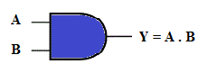
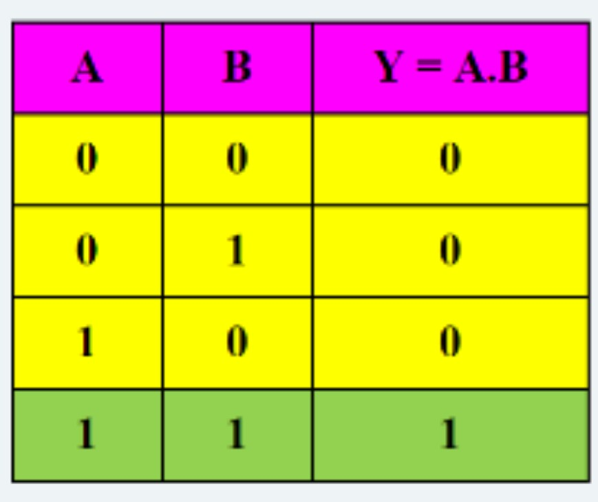
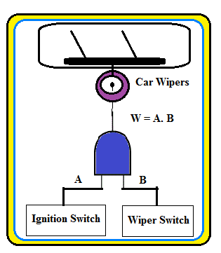

 CAR WIPER CONTROL

1 INTRODUCTION

AND, OR and NOT gates are basic logic gates and are fundamental building blocks from which all other logic circuits and digital systems can be constructed. Simple car wiper control, automatic door and window lock, control circuitry in a telephone exchange, logic steering in industrial controls, level controls in storage tanks, speed control, robots and many other monitoring and control circuits make use of digital logic gates. In all such applications, the logical concepts are extensively used to take decisions based on status of some input parameters and in turn control some appliances/devices.

1.1 AND GATE
|Description | Produces a HIGH output only if all the inputs are HIGH. |
|-------|--------------------|
|Symbol|| 
|Truth Table||
1.2    TERMINOLOGY USED

a.     Bit: An acronym for a *binary digit* that can take a binary value 0 or 1.

b.     Gates: The circuits that perform the fundamental logical operations are called *gates*.

c.      Truth Table: A *truth table* is a compact way of representing the statements that define the values of the dependent variables. On the left side of the truth table, we list all possible values in increasing binary order. This is done to help keep the table orderly. The corresponding values of the dependent variables (output) are listed on the right side of the table.

2 APPLICATION: CAR WIPER CONTROL

Automobile industry makes use of digital circuits to monitor fuel level, tyre pressure, and engine status and provide the indication in the form of alarm. Logical concepts of ANDing operation can be used to illustrate the turning ON/OFF of the car wipers, fan, AC etc.

2.1    CONCEPT

AND gate can be used to turn ON the car wipers located on the windshield when the ignition key AND the wiper switch both are ON. The assumption made here is that the ignition and the wiper circuit outputs are digital in nature, hence can be directly connected to the two inputs of AND gate. This concept is demonstrated in Fig.1 below. When the *ignition key is ON* and the *wiper switch is turned ON*, then the *wipers move* on the windshield screen and clean the glass.  

    

Figure 1 Car Wiper Control Concept